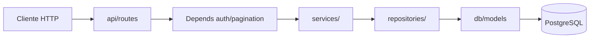

# PT Manager — Arquitetura

## Visão Geral

Monorepo com backend FastAPI e frontend React, deploy separado (Render + Vercel).

```
Projeto_pt_manager/
├── backend/app/          # API Python
├── frontend/src/         # SPA React
├── .claude/              # Config AI (Claude Code)
└── .cursor/              # Config AI (Cursor)
```

## Backend — Camadas

```
api/routes/       → HTTP, Depends(auth), delegação para services
api/schemas/      → Pydantic request/response DTOs
api/deps/         → Helpers (pagination, etc.)
services/         → Lógica de negócio (22 services)
repositories/     → Acesso a dados SQLModel (11 repos — parcial, alguns services acedem DB directamente)
db/models/        → Entidades SQLModel ORM
db/migrations/    → SQL numerado (001_, 002_, …) via migrate_runner.py
core/             → config.py, security.py, rate_limit.py
middleware/       → Rate limiting por email
workers/          → APScheduler (lembretes de sessão)
templates/        → Jinja2 para emails (Resend)
utils/            → logging, time helpers
main.py           → App factory, CORS, lifespan, registo de routers
```

### Fluxo de uma request



## Autenticação e Autorização

| Router | API Key | JWT | Notas |
|--------|---------|-----|-------|
| health, stripe_webhook | Não | Não | Monitorização / HMAC Stripe |
| auth, signup, invite | Sim | Não | Login e registo |
| Restantes | Sim | Sim | Role/subscription guards por endpoint |

Roles: `superuser`, `trainer`, `client`.

Multi-tenant: `trainer_id` extraído do JWT (`owner_trainer_id`). Todas as queries de dados de cliente devem filtrar por este ID.

## Frontend — Estrutura

```
api/              → 17 módulos Axios por domínio + axiosConfig.js
pages/
  admin/          → Dashboard superuser
  trainer/        → Gestão de clientes, planos, billing
  client/         → Portal do cliente
layouts/          → TrainerLayout, AdminLayout, ClientLayout
components/
  ui/             → shadcn/ui (TypeScript .tsx)
  */              → Componentes de domínio (JavaScript .jsx)
context/          → AuthContext.jsx
hooks/            → Custom hooks (5)
lib/              → helpers, utils
App.jsx           → Router raiz com namespaces por role
```

### Estado e dados

- Sem Redux/Zustand/React Query — fetch directo em pages/components
- Auth via `AuthContext` + `ProtectedRoute`
- Dívida técnica: páginas monolíticas (ex: `AssessmentPage.jsx` ~84KB)

## Migrations

- Ficheiros SQL em `backend/app/db/migrations/`
- Runner: `python -m app.db.migrate_runner` (standalone, não no lifespan HTTP)
- Tabela `schema_migrations` regista migrations aplicadas
- **Nunca** editar SQL já aplicado em qualquer ambiente

## Deploy

| Serviço | Plataforma | Notas |
|---------|-----------|-------|
| API | Render | Docker, pre-deploy migrations, health check |
| Frontend | Vercel | SPA routing via vercel.json |
| DB | PostgreSQL 16 | SQLite apenas local/CI |

## Dívida Técnica Conhecida

1. Repository layer incompleta (21 routes, 11 repos)
2. Frontend misto JSX/TSX sem migração completa
3. Chakra UI + shadcn coexistem
4. Páginas frontend muito grandes, pouco testadas
5. `pyproject.toml` description ainda diz "single-user"
