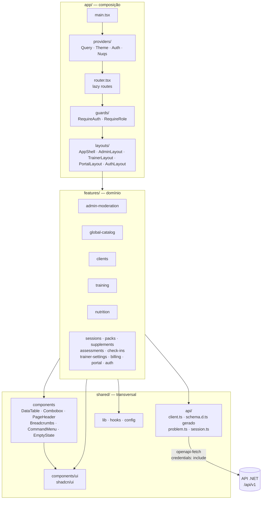
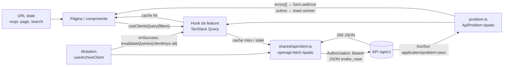
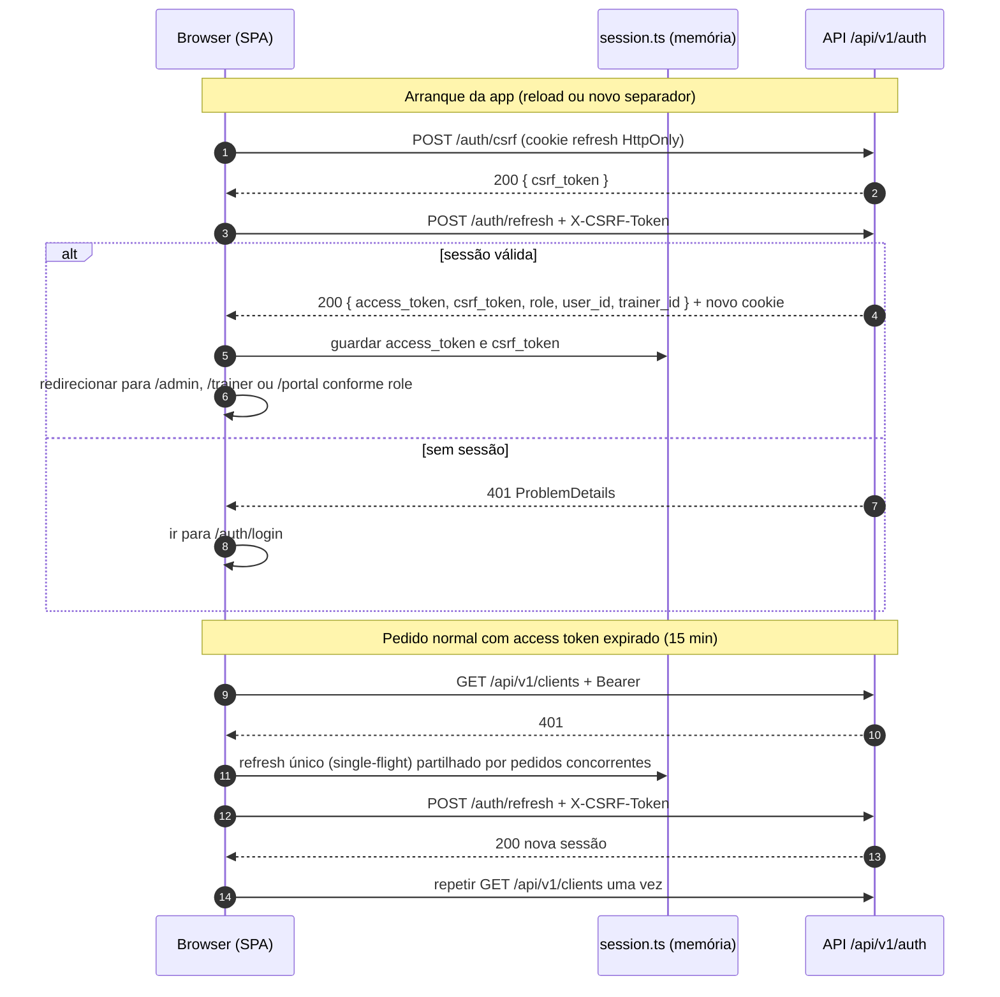
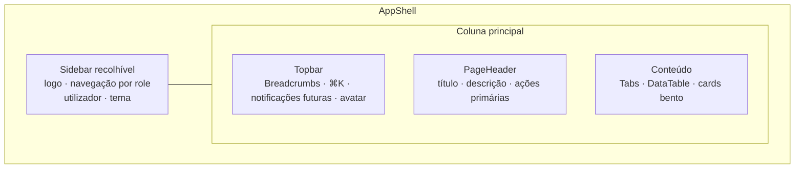

# Arquitetura do Frontend

*Versão 1.0 — 2026-09-15 — alvo do Sprint 6*

## 1. Princípios

1. **Organização por feature**, espelhando os módulos do backend. Uma feature contém
   tudo o que precisa (API, hooks, componentes, páginas, schemas) e expõe só o que outras
   partes usam através de `index.ts`.
2. **O contrato vem do backend.** Tipos e cliente HTTP são gerados do OpenAPI; ninguém
   escreve à mão um tipo de resposta da API.
3. **Estado do servidor ≠ estado da UI.** Dados da API vivem no cache do TanStack Query;
   filtros e paginação vivem no URL (`nuqs`); estado local fica em `useState`. Sem store
   global até existir um caso concreto.
4. **Segurança no browser:** access token e CSRF token só em memória; refresh token só
   em cookie HttpOnly gerido pelo backend. Nada sensível em `localStorage`.
5. **Dependências numa só direção:** `app → features → shared`. `shared` nunca importa
   de `features`; uma feature nunca importa ficheiros internos de outra.

## 2. Camadas



## 3. Estrutura de pastas

```
frontend/
├── public/                     logo.svg, favicon.svg, favicon.ico, apple-touch-icon.png
├── src/
│   ├── app/
│   │   ├── main.tsx
│   │   ├── router.tsx          rotas lazy por role
│   │   ├── providers/          QueryProvider, ThemeProvider, AuthProvider
│   │   ├── layouts/            AppShell (sidebar + topbar), um layout por role
│   │   └── guards/             RequireAuth, RequireRole
│   ├── features/
│   │   └── clients/            (exemplo; todas as features seguem o mesmo molde)
│   │       ├── api/
│   │       │   ├── keys.ts         query keys da feature
│   │       │   ├── queries.ts      useClientsQuery, useClientQuery
│   │       │   └── mutations.ts    useCreateClient, useArchiveClient
│   │       ├── components/     ClientForm, ClientStatusBadge
│   │       ├── pages/          ClientsPage, ClientDetailPage
│   │       ├── schemas/        client.schema.ts (zod)
│   │       └── index.ts        API pública da feature (rotas + componentes reutilizáveis)
│   ├── shared/
│   │   ├── api/
│   │   │   ├── schema.d.ts     GERADO por openapi-typescript (não editar)
│   │   │   ├── client.ts       instância openapi-fetch + middleware auth/CSRF/refresh
│   │   │   ├── session.ts      access token e CSRF token em memória
│   │   │   └── problem.ts      parse de ProblemDetails → erro tipado
│   │   ├── components/
│   │   │   ├── ui/             shadcn/ui (código próprio)
│   │   │   └── …               DataTable, Combobox, PageHeader, Breadcrumbs, CommandMenu, ThemeToggle
│   │   ├── config/             env.ts (valida VITE_*), navigation.ts (menu por role)
│   │   ├── hooks/              useDebounce, useMediaQuery
│   │   ├── lib/                cn, format (datas, números), invariant
│   │   └── styles/globals.css  tokens de design (ver 03)
│   └── test/                   setup.ts, msw/handlers.ts, render.tsx
├── e2e/                        Playwright (Sprint 8)
└── vite.config.ts · tsconfig.json · eslint.config.js · components.json
```

### Mapa feature ↔ backend

| Feature | Endpoints (ver `../backend/01_API_ENDPOINTS.md`) | Role | Fase |
|---|---|---|---|
| `auth` | `/auth/*`, `/auth/google/*` | todos | 6A (mínimo) · 6E (final) |
| `admin-moderation` | `/admin/content-moderation/*` | superuser | 6B |
| `global-catalog` | `/global-exercises`, `/global-foods`, `/global-supplements` | superuser | 6B |
| `clients` | `/clients`, `/auth/invite-client` | trainer | 6C |
| `assessments` | `/initial-assessments`, `/clients/{id}/initial-assessment` | trainer | 6C |
| `sessions` · `packs` | `/sessions`, `/pack-types`, `/client-session-packs` | trainer | 6C |
| `training` | `/exercises`, `/training-plans`, `/exercise-set-logs` | trainer | 6C |
| `nutrition` | `/foods`, `/meal-plans`, `/nutrition/preview` | trainer | 6C |
| `supplements` | `/supplements`, `/supplement-assignments` | trainer | 6C |
| `check-ins` | `/check-ins` | trainer | 6C |
| `trainer-settings` · `billing` | `/trainer-settings/*`, `/billing/*` | trainer | 6C |
| `portal` | `/portal/*`, `/auth/accept-invite` | client | 6D |

## 4. Fluxo de dados



Regras:

- Uma query key por recurso, construída em `features/<f>/api/keys.ts`
  (`clientKeys.list(filters)`, `clientKeys.detail(id)`).
- Mutations invalidam as keys afetadas; não se atualiza cache manualmente sem motivo.
- Listas paginadas usam `placeholderData: keepPreviousData` para não piscar entre páginas.

## 5. Autenticação no browser

Contrato completo em `../backend/02_CONTRATO_HTTP_FRONTEND.md`.



Pontos de atenção a validar na 6A:

1. **Vários separadores:** o refresh roda o token e o backend deteta reutilização. Dois
   separadores a fazer refresh ao mesmo tempo podem invalidar a sessão. Serializar o
   refresh entre separadores (Web Locks API `navigator.locks` ou `BroadcastChannel`) e
   testar antes de fechar a 6A.
2. **HTTPS em desenvolvimento:** o cookie usa o prefixo `__Secure-` (exige HTTPS), o
   CORS aceita apenas origens HTTPS e `AuthController` valida o `Origin`. O Vite local
   corre em HTTPS e a origem (ex.: `https://localhost:5173`) entra em
   `Cors:AllowedOrigins` via User Secrets de Development.
3. **Sites diferentes em produção** (Vercel vs Render): exige `AuthCookies:SameSite=None`
   e sujeita-se a bloqueio de cookies de terceiros. Decisão de subdomínios do mesmo site
   ou BFF fica para o Sprint 9 (Produção), como já prevê `00_ARCHITECTURE.md` §5.
4. Nunca repetir automaticamente pedidos `POST` não idempotentes depois de um refresh
   falhado; só depois de refresh bem-sucedido e uma única vez.

## 6. Rotas e guards

```mermaid
flowchart TD
    ROOT["/"] --> BOOT{"Sessão restaurada?"}
    BOOT -->|"não"| LOGIN["/auth/login"]
    BOOT -->|"superuser"| ADMIN["/admin"]
    BOOT -->|"trainer"| TRAINER["/trainer"]
    BOOT -->|"client"| PORTAL["/portal"]

    subgraph AUTH["/auth — AuthLayout, público"]
        LOGIN
        SIGNUP["/auth/signup"]
        RESET["/auth/password-reset"]
        CONFIRM["/auth/confirm-email"]
        INVITE["/auth/accept-invite"]
    end

    subgraph ADM["/admin — RequireRole superuser"]
        ADMIN --> A1["/admin/moderation"]
        ADMIN --> A2["/admin/catalog/exercises"]
        ADMIN --> A3["/admin/catalog/foods"]
        ADMIN --> A4["/admin/catalog/supplements"]
    end

    subgraph TRN["/trainer — RequireRole trainer"]
        TRAINER --> T1["/trainer/clients/:clientId"]
        TRAINER --> T2["/trainer/sessions"]
        TRAINER --> T3["/trainer/training-plans/:planId"]
        TRAINER --> T4["/trainer/meal-plans/:planId"]
        TRAINER --> T5["/trainer/library<br/>exercícios · alimentos · suplementos"]
        TRAINER --> T6["/trainer/check-ins"]
        TRAINER --> T7["/trainer/settings · /trainer/billing"]
    end

    subgraph PRT["/portal — RequireRole client"]
        PORTAL --> P1["/portal/plan"]
        PORTAL --> P2["/portal/nutrition"]
        PORTAL --> P3["/portal/supplements"]
        PORTAL --> P4["/portal/check-ins"]
        PORTAL --> P5["/portal/profile"]
    end
```



Rotas finais de cada página são fixadas no blueprint da respetiva fase; este mapa define
os namespaces e os guards. Um utilizador que abra uma rota de outro role é redirecionado
para a sua home, não vê um ecrã de erro.

## 7. Layout (AppShell)



Em mobile a sidebar passa a `Sheet` e o portal do cliente usa navegação inferior.

## 8. Testes

| Nível | Ferramenta | O quê | Quando |
|---|---|---|---|
| Unitário | Vitest | `shared/lib`, schemas zod, mapeamento de ProblemDetails | desde 6A |
| Componente | Vitest + Testing Library + MSW | páginas e formulários com API simulada | cada feature |
| Contrato | `openapi-typescript` no CI | build falha se o schema gerado divergir | 6A (CI mínimo) |
| E2E | Playwright | fluxos críticos contra backend real com seed | Sprint 8 |

## 9. Anti-padrões proibidos

- `fetch`/`axios` direto em componentes ou páginas.
- Tipos de resposta escritos à mão quando existem no `schema.d.ts`.
- Tokens em `localStorage`/`sessionStorage`.
- Importar `features/x/components/Foo` a partir de `features/y` (usar `features/x/index.ts`
  ou mover para `shared`).
- Cores hex no JSX; usar tokens semânticos.
- Desenhar ecrãs funcionais para capacidades sem backend (ver 04).
